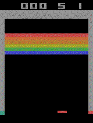

# DQN-PyTorch-Breakout
## Overview
An attempt at recreating DeepMind's implementation of Deep Q Learning on Atari Breakout using PyTorch.
Used [A3C model](https://medium.com/emergent-future/simple-reinforcement-learning-with-tensorflow-part-8-asynchronous-actor-critic-agents-a3c-c88f72a5e9f2) and [LSTM](http://colah.github.io/posts/2015-08-Understanding-LSTMs/) layer for the neural network.

## Dependencies
* PyTorch
* [OpenAI Gym](https://github.com/openai/gym)
* Pillow
* Numpy

## Example of a trained agent playing Breakout

